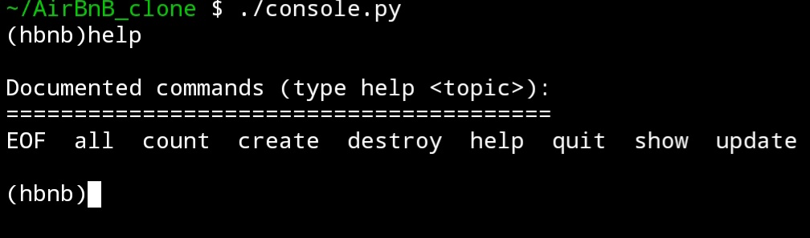

<h1> AirBnB </h1>

<h2> AirBnB clone - The console </h2>
<h3> About the project 📋 </h3>

- &nbsp; This is the first step towards create a simple copy of the AirBnB website. 
- &nbsp; In this project I create:
- &nbsp; All objects used for the application (BaseModel, User, State, City, Place…)
- &nbsp; Create abstracted storage engine for serialization/deserialization: Instance <-> Dictionary <-> JSON string <-> file
- &nbsp; Command interpreter to manage the objects of my application using cmd.Cmd model.

### Usage :🛠️:

### Authors :fountain_pen:
* Abdulrahman Alidrisy - @a.alidrisy6
